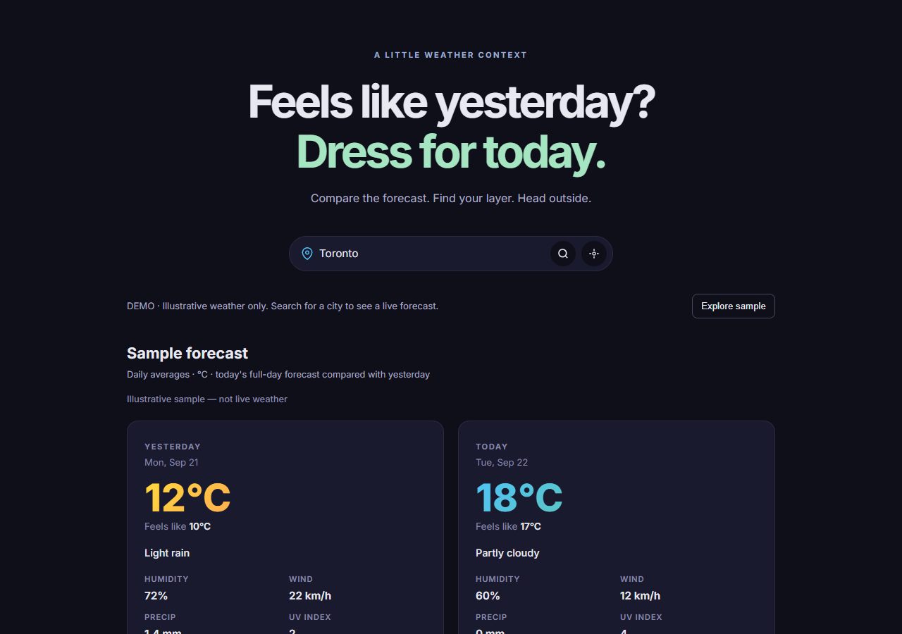

# LayerUp · Feels Like Yesterday

**A little weather context before you head outside.** Compare today's forecast with yesterday, see what changed, and choose a comfortable layer.

[Live demo](https://felimart2003.github.io/feels-like-yesterday/) · [Source](https://github.com/felimart2003/feels-like-yesterday)



## Features

- City search and optional browser geolocation, with no API key or account.
- Yesterday/today comparisons using the selected location's dates and daily averages.
- Provider-supplied apparent temperature, daily precipitation totals, humidity, wind, and maximum UV index.
- Temperature-based clothing suggestions and an accessible visual dial.
- Private outfit notes scoped by location and date, stored on your device.
- Explicit sample mode, visible network errors, request timeouts, and protection against stale search responses.
- Responsive layout, keyboard focus, reduced motion, and screen-reader status announcements.

## Run locally

No dependency installation or build is required. From this directory:

```sh
python -m http.server 5500
```

Open http://localhost:5500. Location permission requires HTTPS or localhost. Live forecasts need internet access; **Explore sample** works without the weather service.

Optional checks with Node.js 22 or newer:

```sh
npm run check
npm test
```

## Architecture

This is a dependency-free HTML/CSS/JavaScript application. `app.js` resolves cities through Open-Meteo's geocoding API, requests hourly weather, aggregates each local calendar day, and renders the comparison. `styles.css` handles layout and accessibility states. Node's built-in test runner verifies weather boundaries, invalid coordinates, missing measurements, timezone handling, provider apparent temperatures, network failure, and unavailable storage.

Only Open-Meteo is used. No paid weather providers, server secrets, frontend credentials, analytics, or database are required. Searches and coordinates are sent to Open-Meteo to retrieve forecasts. Outfit notes remain in browser localStorage; clearing site data removes them.

## Data and limitations

Temperatures, apparent temperatures, humidity, and wind are daily averages, not current observations. Precipitation is a daily sum; UV is the daily maximum. Today's remaining hours are a forecast, and yesterday's values are model data rather than a certified historical observation record. Conditions describe the midday hour. Search chooses the first matching city returned by the provider; add a more specific place name if needed. Clothing suggestions are general comfort guidance, not personalized safety advice.

Sample data is always labeled and is never silently substituted for a failed live request. Failed searches preserve the previous forecast with an explicit message.

## Deployment

Hosted free on GitHub Pages from `main` at the repository root, using `.nojekyll`. Pushes to `main` publish the static files. No environment variables are needed. The same files can also be hosted by Cloudflare Pages or Netlify without a build command.

Weather and geocoding: [Open-Meteo](https://open-meteo.com/) ([API documentation](https://open-meteo.com/en/docs), [terms](https://open-meteo.com/en/terms)).
